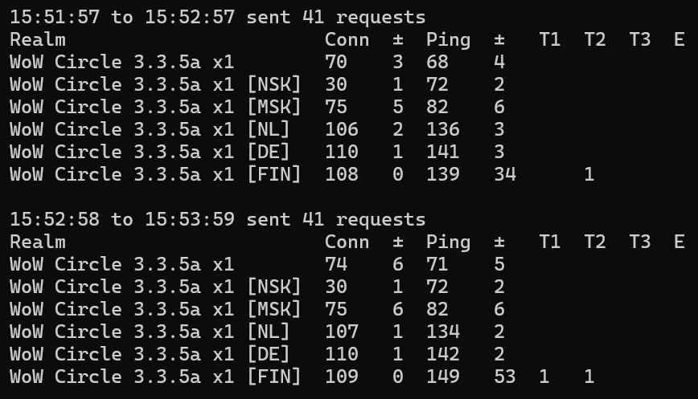
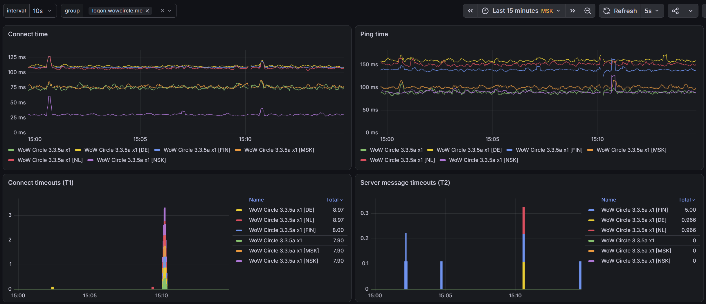

# wow-server-ping

| **🇬🇧 English** | [🇷🇺 Русский](README.ru.md) |
| :-: | :-: |

Ping tool for World of Warcraft 335a servers. Can correctly measure ping with servers behind proxy.



Definitions:

- `Conn` - mean connect time to game server in milliseconds
- `Ping` - mean ping time to game server in milliseconds
- `±` - mean absolute deviation of `Conn` and `Ping`
- `T1` - timeouts during initial TCP connection
- `T2` - timeouts after `T1` and until receiving first server message
- `T3` - timeouts after `T2`, during sending a message to the server and until server connection close
- `E` - errors

It can work as a Prometheus metrics exporter and display graphics in Grafana:



## Usage

### Downloads

For Windows you can find builds on the [Release page](https://github.com/egoroof/wow-server-ping/releases/latest). Open an issue if you need another OS builds.

### Realm list

If you are interested in the `WoW Circle 3.3.5a` server you don't need to extract realm list - it's already included in the build. You can skip this step.

You will need to extract realm list first. Wow servers can give you realm list only after login, so you will have to enter your username and password. This project comes with `realmlist.exe` utility, which logins to WoW server similar real WoW game client and save realm list to `servers` folder.

Usage:

```shell
realmlist.exe [-port N] [-timeout T] user host
```

Example:

```shell
realmlist.exe admin logon.wowcircle.me
```

If you worry about your credentials you can also run Wireshark, login in your WoW client and extract realmlist yourself.

### Ping

Simple example, which  loads realm list from `servers/logon.wowcircle.me.json` file, sends ping requests and print statistics every 30 seconds:

```shell
wow-ping.exe logon.wowcircle.me
```

You can filter servers by regexp with `-filter` option:

```shell
wow-ping.exe -filter "x4" logon.wowcircle.me
```

Windows builds comes with some `.bat` files which you can use or make similar for you.

### Available settings

| Flag | Default | Description |
|---|---|---|
| `-port` | - | Listen port for Prometheus metrics |
| `-timeout` | `1s` | Ping timeout |
| `-interval` | `1s` | Sleep time between requests |
| `-stats-interval` | `10s` | How often stats should be printed to console |
| `-stats` | - | How many stats to display before exit |
| `-filter` | - | Regexp for filter servers by name |

### Ping process

#### Behind proxy

Network requests during single ping process:

1. You -> TCP SYN -> Proxy
2. Proxy -> TCP SYN-ACK -> You
3. You -> TCP ACK -> Proxy
4. Proxy -> TCP SYN -> Server
5. Server -> TCP SYN-ACK -> Proxy
6. Proxy -> TCP ACK -> Server
7. Server -> packet `SMSG_AUTH_CHALLENGE` -> Proxy -> You
8. You -> packet `CMSG_PING` -> Proxy -> Server
9. Server -> TCP FIN -> Proxy -> You
10. You -> TCP FIN -> Proxy -> Server

Some not important acknowledge requests hidden for simplicity.

Сonnection time (`Conn`) measured from steps 1 - 2 and server ping (`Ping`) from steps 8 - 9.

Timeouts can be helpful for debugging packet losses. There are 3 types of timeouts:

- `T1` - if happen in steps 1 - 2 (you - proxy)
- `T2` - if happen in steps 3 - 7 (proxy - server)
- `T3` - if happen in steps 8 - 9 (you - server)

#### Without proxy

1. You -> TCP SYN -> Server
2. Server -> TCP SYN-ACK -> You
3. You -> TCP ACK -> Server
4. Server -> packet `SMSG_AUTH_CHALLENGE` -> You
5. You -> packet `CMSG_PING` -> Server
6. Server -> TCP FIN -> You
7. You -> TCP FIN -> Server

Connection time (`Conn`) measured from step 1 - 2 and server ping (`Ping`) from steps 5 - 6.

Without a proxy the `Conn` and `Ping` values should be almost the same. But we don't know about proxy and we perform the same ping process as with a proxy.

Timeouts:

- `T1` - if happen in steps 1 - 2
- `T2` - if happen in steps 3 - 4
- `T3` - if happen in steps 5 - 6

## Antivirus reaction

Some antivirus software can detect malware (false positive) in downloaded Windows release and block download. You can add an exception and try to download it again. This tool doesn't have any malware. You can check source code and compile it yourself with golang. Also you can scan it with VirusTotal.
