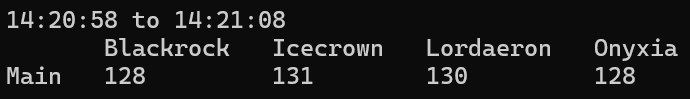
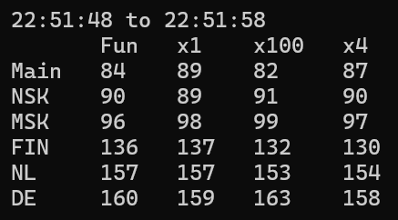
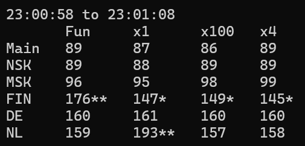
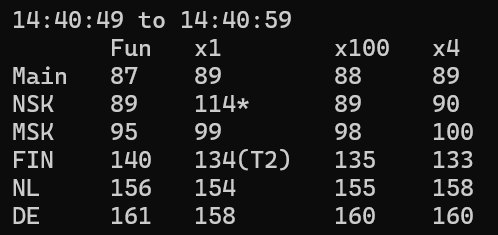
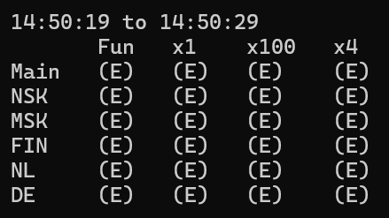
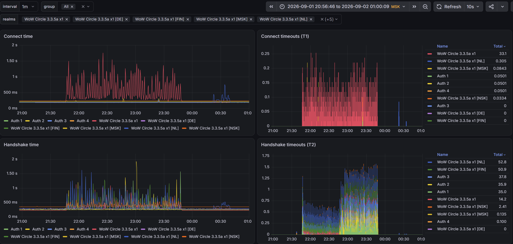

# wow-server-ping

| **English** | [Русский](README.ru.md) |
| :-: | :-: |

Ping tool for World of Warcraft 3.3.5a servers. Correctly measures ping to servers behind a proxy.

## Simple example

A simple example of the output from the ping tool for Warmane server:



In the picture above there is a time interval and ping to every server.

## Example with proxy servers

Example of console output for WoW Circle servers:



In the picture above there are four servers (`Fun`, `x1`, `x100`, `x4`). All of them have `Main` entry point and five proxies (`NSK`, `MSK`, `FIN`, `NL`, `DE`).

## Ping deviation

If ping is not stable and changes fast - it's called ping deviation. Ping deviation is displayed as an asterisk symbol (`*`). If ping without deviation - number will be without asterisk. The greater the deviation, the more asterisks are added:



## Timeouts

If a network ping request takes too long to complete - it is aborted and marked as a timeout. Timeouts are displayed in parentheses as the letter T and a number - for example `(T2)`:



Timeouts are divided into three types for ease of debugging:

- `(T1)` - timeouts during connection
- `(T2)` - timeouts during handshake
- `(T3)` - timeouts during ping

See [Ping process](#ping-process) for explanation about connection, handshake and ping.

## Errors

In addition to timeouts, errors may also occur. They are displayed as `(E)`. For example, if you disable internet access, it will look like this:



All errors are logging into `errors` folder and corresponding file with filename like `2026-10-08_14-39-49.txt`:

```
2026/10/08 14:53:40 WoW Circle 3.3.5a x1 dial tcp 87.228.58.62:11294: connectex: A socket operation was attempted to an unreachable network.
```

## Usage

### Downloads

Builds are available at the [Release page](https://github.com/egoroof/wow-server-ping/releases/latest).

### Realm list

Some popular server realm lists already included in the build:

- WoW Circle
- Warmane

If you are interested in these servers you don't need to extract realm list. You can skip this step.

This tool doesn't work with the Sirus server.

### Realm list extraction

You will need to extract realm list first. Wow servers can give you realm list only after login, so you will have to enter your username and password. This project has an utility, which logins to WoW server similar real WoW game client and save realm list to `servers` folder.

Start `realmlist.bat` on Windows (from `bat` folder) or `realmlist` on Linux. It will ask server host, your username and password.

If you worry about your credentials you can run Wireshark, login in your WoW client and extract realmlist yourself.

### Ping

Simple example, which  loads realm list from `servers/wowcircle.json` file, sends ping requests and print statistics every 10 seconds:

```shell
wow-ping.exe wowcircle
```

You can filter servers by regexp with `-filter` option:

```shell
wow-ping.exe -filter "x4" wowcircle
```

Windows builds comes with some `.bat` files which you can use or make similar for you.

### Available settings

| Flag | Default | Description |
|---|---|---|
| `-timeout` | `3s` | Ping timeout |
| `-interval` | `1s` | How often send ping requests |
| `-stats-interval` | `10s` | How often stats should be printed to console |
| `-ping-auth` | `false` | Whether to ping auth servers |
| `-filter` | - | Regexp for filter servers by name |
| `-stats` | - | How many stats to display before exit |
| `-port` | - | Listen port for Prometheus metrics |

## Ping process

We suppose a WoW server can be behind a proxy or a client can use VPN.
That's why a simple ICMP or TCP ping isn't enough.
We need to send and recieve a packet after handshake established to measure ping correctly.

Network requests during a single ping process:

| # | Connection | Handshake | Ping |
|---|---|---|---|
| 1 | You TCP SYN → Proxy | | |
| 2 | Proxy TCP SYN-ACK → You | | |
| 3 | | You TCP ACK → Proxy | |
| 4 | | Proxy TCP SYN → Server | |
| 5 | | Server TCP SYN-ACK → Proxy | |
| 6 | | Proxy TCP ACK → Server | |
| 7 | | Server `SMSG_AUTH_CHALLENGE` → Proxy → You | |
| 8 | | | You `CMSG_AUTH_SESSION` → Proxy → Server |
| 9 | | | Server `SMSG_AUTH_RESPONSE` → Proxy → You |
| | Timeouts `T1` | `T2` | `T3` |

## Antivirus reaction

Some antivirus software can detect malware (false positive) in downloaded Windows release and block download. You can add an exception and try to download it again. This tool doesn't have any malware. You can check source code and compile it yourself with golang. Also you can scan it with VirusTotal.

## Prometheus metrics

This tool can work as a [Prometheus](https://prometheus.io) metrics exporter and display graphics in [Grafana](https://grafana.com/oss/grafana/):



Pass the `-port` option:

```shell
wow-ping.exe -port 8090 wowcircle
```

Metrics will be available at `http://localhost:8090/metrics`. Then you will need to setup Prometheus to grab this metrics.
