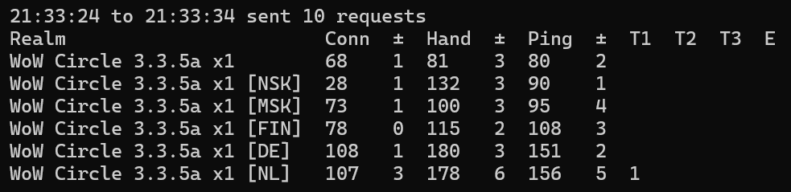
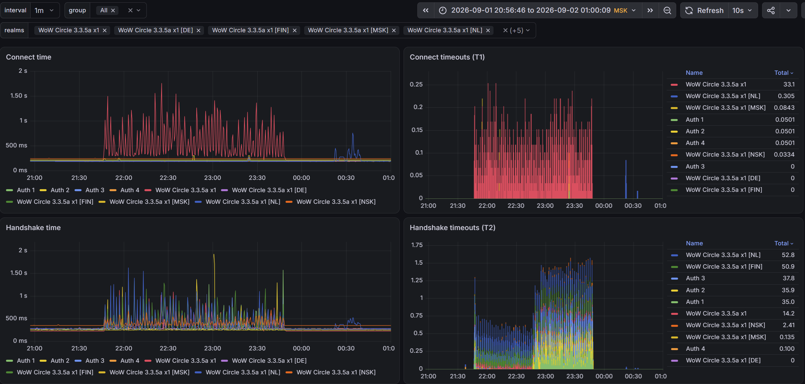

# wow-server-ping

| [English](README.md) | **Русский** |
| :-: | :-: |

Утилита для пинга серверов World of Warcraft 3.3.5a. Корректно вычисляет пинг до серверов, находящихся за прокси.



Обозначения:

- `Sent` - количество отправленных пинг запросов
- `Conn` - среднее арифметическое времени подключения к серверу WoW в миллисекундах
- `Hand` - среднее арифметическое времени установления соединения с сервером WoW в миллисекундах
- `Ping` - среднее арифметическое времени пинга WoW сервера в миллисекундах
- `±` - среднее абсолютное отклонение для `Conn`, `Hand` и `Ping`
- `T1` - таймауты во время подключения
- `T2` - таймауты во время установления соединения
- `T3` - таймауты во время пинга
- `E` - ошибки

Смотрите [Описание процесса пинга](#описание-процесса-пинга) для объяснения разницы между подключением, установлением соединения и пингом.

## Использование

### Скачивание

Сборки можно скачать со [страницы релизов](https://github.com/egoroof/wow-server-ping/releases/latest).

### Список миров

Если вас интересует сервер `WoW Circle 3.3.5a`, то список миров не нужно извлекать - он уже поставляется вместе со сборкой. Можете переходить к следующий главе.

Сначала вам нужно будет извлечь список миров. Сервера WoW дают список миров только после логина, поэтому вам придётся ввести ваш логин/пароль. Этот проект содержит утилиту, которая логинится на сервер WoW подобно реальному игровому клиенту WoW и сохраняет список миров в папку `servers`.

Запустите `realmlist.bat` на Windows или `realmlist` на Linux. Нужно будет ввести адрес сервера, ваш логин и пароль.

Если переживаете за свои учётные данные, то можете запустить Wireshark, залогиниться через свой игровой клиент и самостоятельно извлечь список миров.

### Пинг

Простой пример, который загружает список миров из файла `servers/logon.wowcircle.me.json`, отправляет пинг запросы и выводит статистику каждые 10 секунд:

```shell
wow-ping.exe logon.wowcircle.me
```

Можно отфильтровать список серверов с помощью регулярного выражения опцией `-filter`:

```shell
wow-ping.exe -filter "x4" logon.wowcircle.me
```

Сборки для Windows содержат `.bat` файлы, которые вы можете использовать, либо сделать подобные для себя.

### Доступные настройки

| Флаг | По умолчанию | Описание |
|---|---|---|
| `-port` | - | Порт для метрик Prometheus |
| `-timeout` | `3s` | Таймаут пинга |
| `-interval` | `1s` | Как часто отправлять пинг запросы |
| `-stats-interval` | `10s` | Как часто выводить статистику в консоль |
| `-stats` | - | Сколько вывести статистики, прежде чем выйти |
| `-filter` | - | Регулярное выражение для фильтрации серверов по названию |

## Описание процесса пинга

Сервер WoW может находиться за прокси или пользователь может быть подключён к VPN.
Поэтому простого пинга ICMP или TCP не достаточно.
Нам нужно отправить и получить пакет данных после установки соединения, чтобы корректно измерить пинг.

Сетевые запросы в процессе одного пинга:

| # | Подключение `Conn` | Установление соединения `Hand` | Пинг `Ping` |
|---|---|---|---|
| 1 | Вы TCP SYN → Прокси | | |
| 2 | Прокси TCP SYN-ACK → Вы | | |
| 3 | | Вы TCP ACK → Прокси | |
| 4 | | Прокси TCP SYN → Сервер | |
| 5 | | Сервер TCP SYN-ACK → Прокси | |
| 6 | | Прокси TCP ACK → Сервер | |
| 7 | | Сервер `SMSG_AUTH_CHALLENGE` → Прокси → Вы | |
| 8 | | | Вы `CMSG_AUTH_SESSION` → Прокси → Сервер |
| 9 | | | Сервер `SMSG_AUTH_RESPONSE` → Прокси → Вы |
| | Таймауты `T1` | `T2` | `T3` |

## Антивирусы

Некоторые антивирусы могут ошибочно помечать скачиваемую сборку для Windows как вирус и блокировать скачивание. Можете добавить исключение и попытаться скачать заново. Эта утилита не содержит вирусов. Можете проверить исходный код и скомпилировать самостоятельно с помощью golang. Кроме того, можете проверить через VirusTotal.

## Метрики Prometheus

Утилита может работать как экспортёр метрик [Prometheus](https://prometheus.io) и отображать графики в [Grafana](https://grafana.com/oss/grafana/):



Выставите опцию `-port`:

```shell
wow-ping.exe -port 8090 logon.wowcircle.me
```

Метрики будут доступны по адресу `http://127.0.0.1:8090/metrics`. Дальше вам нужно будет настроить Prometheus, чтобы он собирал эти метрики.
